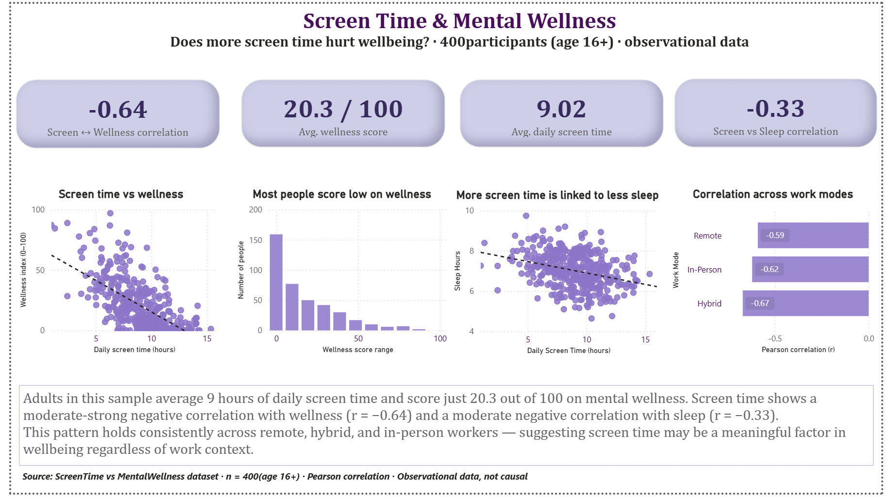

# Screen Time & Mental Wellness Analysis

A data analysis project exploring the relationship between daily screen time 
and mental wellness among 400 participants (age 16+).

Built as part of the Elhouda Lab portfolio.

---

## Overview

This project investigates whether higher daily screen time is associated with 
lower mental wellness, reduced sleep, and higher stress levels. The analysis 
includes descriptive statistics, correlation analysis, and group-level 
breakdowns by work mode (remote, hybrid, in-person).

---

## Key Findings

- Screen time and mental wellness show a moderate-strong negative correlation 
  (r = -0.64)
- Screen time and sleep hours show a moderate negative correlation (r = -0.33)
- The majority of participants score below 30 out of 100 on the wellness index
- The negative correlation holds consistently across all work modes:
  - Hybrid: r = -0.67
  - In-person: r = -0.62
  - Remote: r = -0.59

---

## Dashboard

Download `ScreenTime-MentalWellness.pbix` to explore the interactive dashboard in Power BI Desktop.
---

## Dataset

- 400 survey participants, age 16+
- File: `ScreenTime vs MentalWellness.csv`

| Variable | Description |
|---|---|
| user_id | Unique participant ID |
| age, gender, occupation | Basic demographics |
| screen_time_hours | Total daily screen usage (hours) |
| mobile_hours, laptop_hours, tv_hours | Device-wise screen breakdown |
| sleep_quality | Self-rated sleep quality (1–10) |
| stress_level | Stress scale (1–10) |
| productivity_score | Productivity rating (1–10) |
| mood, energy, focus | Mental wellness indicators |

---

## Tools Used

- Power BI — dashboard and visualization
- Excel — data preparation

---

## Methodology

Pearson correlation coefficients were calculated between screen time hours and 
mental wellness index, overall and segmented by work mode. All findings are 
observational — correlation does not imply causation.

